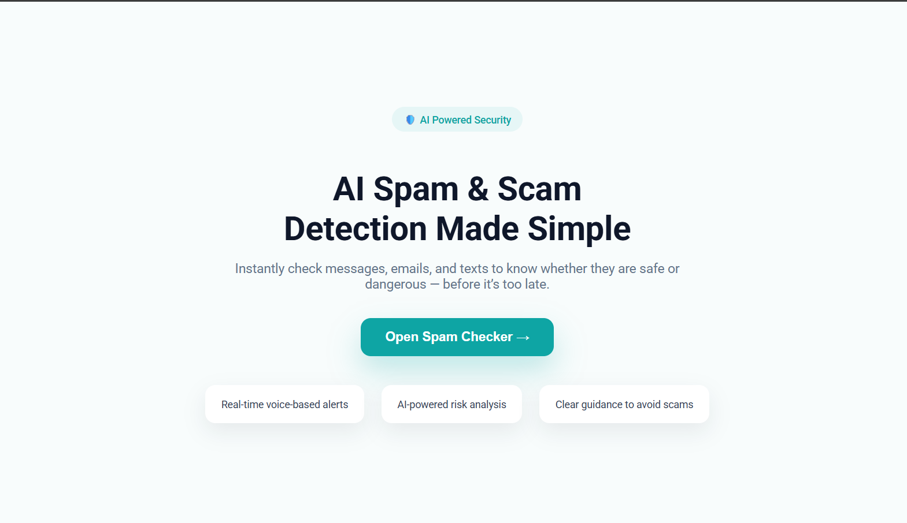
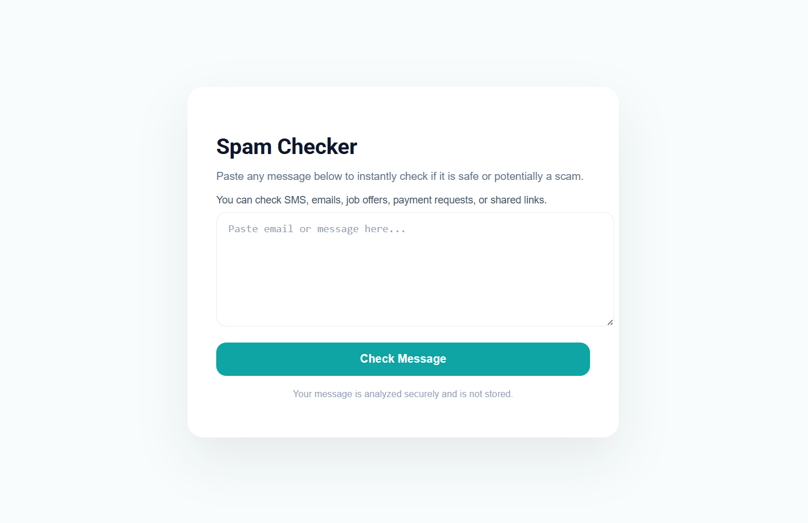
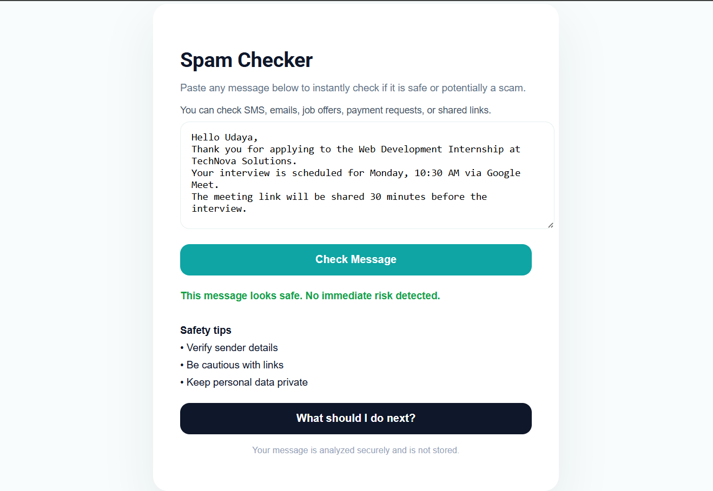

🛡️ AI Spam & Scam Message Detector (Web Application)

An AI-powered web application built using HTML, CSS, JavaScript, and Flask, designed to detect spam, phishing, and scam messages in real time.
The website provides clear visual alerts, context-based safety warnings, and easy-to-understand guidance to help users avoid online scams.

🚀 Features

✅ AI-powered detection that identifies scam, phishing, and safe messages

🚨 Clear visual alerts to instantly show whether a message is risky or safe

🧠 Smart, context-aware warnings, including:

❌ Avoid clicking suspicious or unknown links

❌ Never make payments based on messages

❌ Banks do not request OTPs or account details via SMS or email

❌ Internship or job offers asking for money are likely scams

🧭 Helpful “What should I do next?” guidance that explains the safest action to take

🌐 Fully browser-based application, no installation required

🔗 Flask backend integrated with an AI NLP model

## 📱 App Output (Mobile View)

    
    
    
  

🧠 How It Works (Simple Explanation)

User pastes an email, SMS, or message into the website

The message is sent to a Flask backend API

An AI phishing detection model analyzes the text

The website displays:

Scam or Safe result

Risk-related warnings

Context-based safety advice

🏗️ Tech Stack

Frontend (Website)

HTML5

CSS3

JavaScript

Backend (AI Server)

Python

Flask

Flask-CORS

⚙️ Setup Instructions

1️⃣ Backend Setup (Flask + AI)

cd backend

pip install -r requirements.txt

python app.py

The backend will run on:

http://127.0.0.1:5000

Hugging Face Transformers

DistilBERT phishing detection mode
